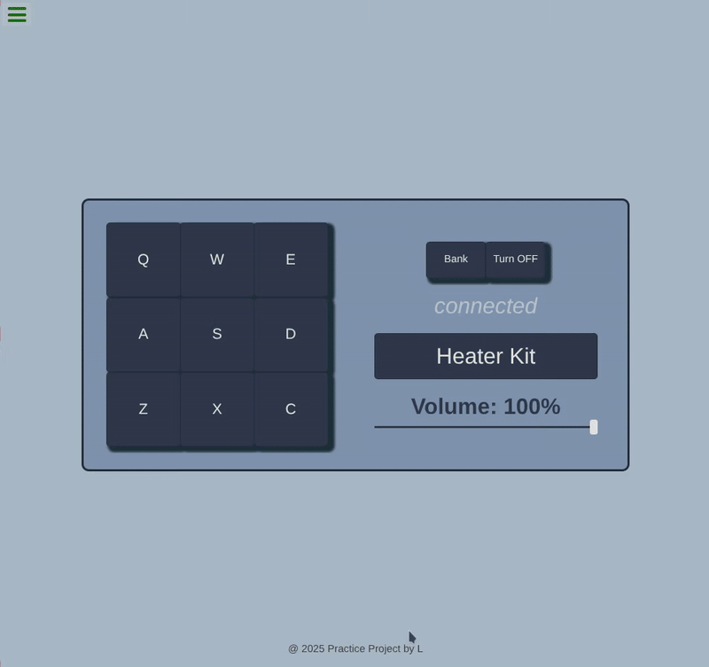

# Drum Machine

An old project built in the first half of 2025 as the start of my journey and posted here to attach to the course's page and to preserve my path.

This project is a part of FreeCodeCamp's Front End Development Libraries Certification. The goal is to build a Drum Machine that allows users to:

- Play two sets of Kits by nine notes each.
- Turn the machine on and off.
- Change the volume.

## 📋 Project Requirements

This project fulfills all **7 user stories** from FreeCodeCamp's "Build a Drum Machine" challenge:

<b>Click to expand the full requirements</b>

 

**User Stories:**
- [x] Outer container with `id="drum-machine"` containing all other elements
- [x] Element with `id="display"` inside `#drum-machine`
- [x] 9 clickable drum pad elements, each with:
  - Class name `drum-pad`
  - Unique `id` describing the audio clip
  - Inner text matching keyboard keys: `Q, W, E, A, S, D, Z, X, C` (in that order)
- [x] HTML5 `audio` element inside each `.drum-pad` with:
  - `src` attribute pointing to audio clip
  - Class name `clip`
  - `id` matching parent's inner text (e.g. `id="Q"`, `id="W"`, etc.)
- [x] Clicking `.drum-pad` triggers its child audio clip
- [x] Pressing associated keyboard key triggers the corresponding drum pad
- [x] When triggered, a unique string describing the audio clip appears in `#display`

**All tests passed** ✅

>I also added extra features beyond the requirements: power on/off toggle, volume control, and two switchable sound banks.

## 🎨 About the Project

### Technologies Used
- **Frontend:** React, Vite, CSS
- **Build Tool:** Vite
- **Deployment:** GitHub Pages

| Drum Machine Preview |
|---|
|  |

<i>submitted to FreeCodeCamp on Mar 4, 2025</i>

---

## 🔗 Live Demo

---

| Third project of my [FreeCodeCamp Front End Libraries Certificate](https://www.freecodecamp.org/certification/fcc058fd235-9bca-44b6-b085-10ee4a9bdda6/front-end-development-libraries) journey |
|---|
|  |

